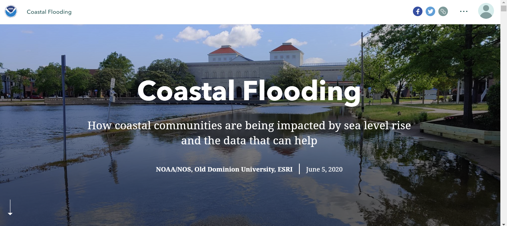
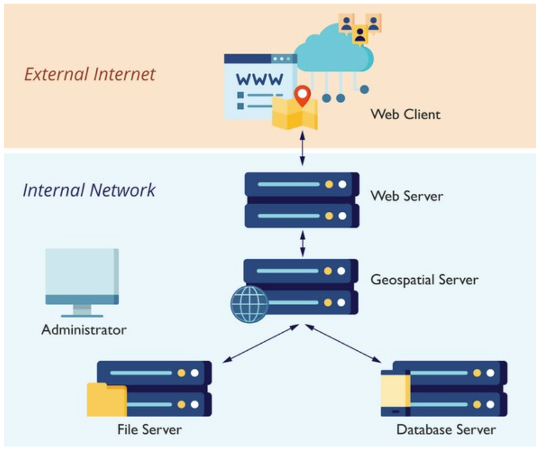
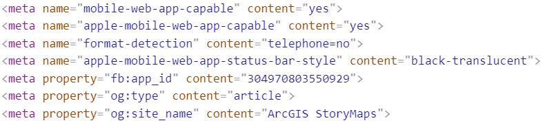
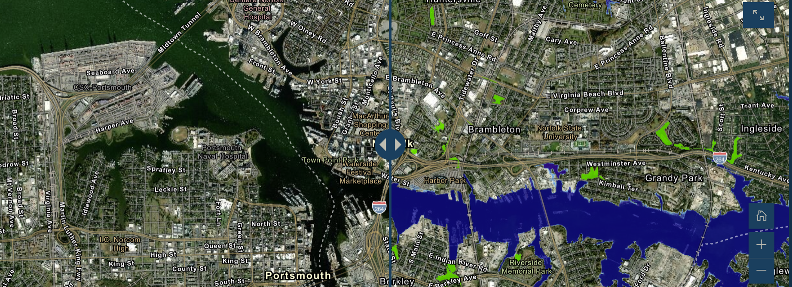

# Digital Geographies Analysis Essay

The geo-narrative that I chose to analyze is called Coastal Flooding. This geo-narrative was created by the National Oceanic and Atmospheric Administration (NOAA) and Old Dominion University. The NOAA is an American scientific agency focused on ocean conditions, waterways, and the atmosphere. Their mission is to *understand and predict changes in climate, weather, oceans, and coasts, to share that knowledge and information with others, and to conserve and manage coastal and marine ecosystems and resources.* The targeted audience is the government, more specifically for a call to action to the people in power to start planning with city planners. The goal of this project is to inform people about the rising water lines due to climate change and how this will potentially affect the future.

> Screenshot of the home page

The themes present are:
* internal politics
* disasters
* economics
* environment, and science

The internal politics revolves around the government and how they should approach the rising sea levels due to climate change. Disasters, environment, and science are the reasons why this topic is important. The rising sea levels and major storms are the reasons why coastal lines suffer from flooding. Economics is also a present theme that should not be overlooked because the state’s economy will suffer when the flood comes because of property loss and therefore is important so start looking at this issue now.

{ width=50% }
> System architecture diagram

This is the general system architecture for web mapping shown in the diagram. The external system is the web client which is what the user can see such as the visuals and content of the page. The external communicates with the internal internet which includes the webserver which processes network requests. The server then requests from the database to access the data, which is pulled from the NOAA’s database, for the information and maps. The data flowed between the client and the server are tile layers, json files and images. The project uses functions from ArcGIS such as widgets and views.
This project supports responsive design. When the dimensions of the screen are changed, the functionality of the story map works. The content responds to the number of pixels on the screen and changes to provide a better user experience.

> Code taken from head of html to show the responsive design implemented into the code

All maps used a raster base map meaning they used aerial images as their foundation. This use of a raster is an important aspect in communicating the conflict at hand. By using raster data combined with a thematic layer of where the flood will affect the city, the conflict is heightened because the flood layer overlaps with actual buildings which makes the situation more real. One map has an interactive feature that zooms into a specific area such as an elementary school or a town so that the reader can see how that area is or will be affected by the coastal flooding.

The map includes many web map elements such as a house button to go back to the default zoom level, a key, a zoom in and out button, an expand button to make the map enlarged, and a vertical bar to view before and after. The house button to return to the default zoom level is convenient for the viewer because it allows the reader to return the map into the specific state the author set. Maps are specific and when a certain area is at focus, it means that there is a reason by the author. The vertical bar to view the city’s current state and after flooding state is a powerful visual way to convey the severity to the reader.

> Sliding vertical divider to quickly switch between the before and predicted after in the future

## Strengths and Weaknesses

Strengths | Weaknesses
------------ | -------------
Longform Infographics | Lack of Map Keys
Multimedia | No directional arrow or scalebar on maps
3 Act Narrative | Navigation bar takes up too much of the screen
> Strengths and Weaknesses Table

The weaknesses of this project include a lack of map keys, and the navigation bar taking a huge presence on the screen. Most maps used in the story do not include a map key which means the reader has to make an assumption about what the thematic layer represents and interpret the meanings as their own. This is a weakness because when displaying a map, readability is very important to convey the meaning across. On the few maps that do include a key, the key is hidden in the bottom left corner with the and the user must hover over it in order to view. The maps also exclude a directional arrow and a scalebar, these two elements are common map elements that are standard in mapmaking. Another weakness of this project is that the navigation bar at the top of the page took too much space on the page. The navigation bar itself was great for navigation but I would suggest shortening the height of the bar so that there can be more information on the page available.

The strengths of this project include its use of vertical direction or longform infographics, multi-media, and three-act narrative. Studies have show that presenting information and data in a vertical manner, rather than the horizontal way or slide show, the reader is able to retain more information. The use of multi-media such as maps, images and charts gave a dynamic visual presentation so that a reader does not have to read as much and can understand in ways other than sentences. The three-act narrative is a structure similar to the classic storytelling of exposition, rising action, climax, falling action and resolution except it is divided into three acts: set-up, conflict and resolution. The story is set up by showing the background of coastal flooding, why and where the flooding occurs. Next, the story shows data to back up their claims in introduce the conflict. The conflict is that coastal flooding is occurring more often in recent years in the past. This can be due to the rise in sea levels because of land-based ice melt, currents, and many other environmental causes. The author uses maps with predictions of the future state of the coastal lines of Norfolk, Virginia to further drive the emergency at hand. The predictions range from 2040 to 2080 to show the rapid increase of the sea levels and what parts of the city will be affected or under water. The final act of the narrative is the resolution. This story ends with a call to action element telling the readers what they can do to help by linking resources to the page. These links include information about rising sea levels, currents, and the NOAA website.

This project can be useful for many countries because countries from different parts of the world are experiencing floods from the rising sea levels, low altitude, or other natural disasters such as storms or hurricanes. Having the data and resources to collect this data shows power because they can manipulate it into anything they want. There can be a power dynamic however between the local government because they could potentially use this data to favor certain areas of their city more than others. This is a problem because this attention is more than likely to wealthier areas while low income areas affected by the floods will not.
